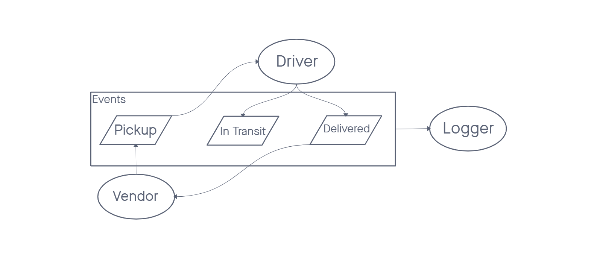
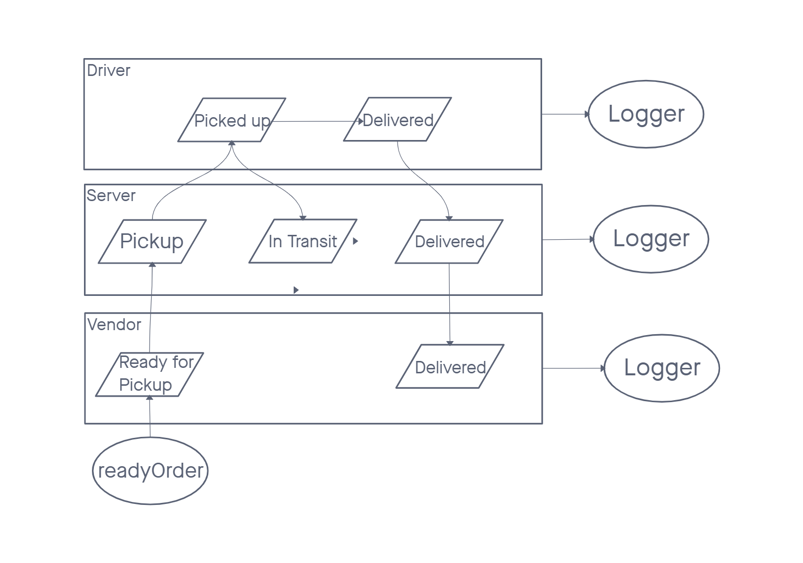

# Code Academy Parcel Service

## Author: Daniel Frey

## Problem Domain

A real-time service that allows for vendors, such as flower shops or restaurants, to alert a system of a package needing to be delivered, for drivers to instantly see what’s in their pickup queue, and then to alert the vendors as to the state of the deliveries (in transit, and then delivered).

<!-- ## Links and Resources

- [ci/cd](http://xyz.com) (GitHub Actions)
- [back-end server url](http://xyz.com) (when applicable)
- [front-end application](http://xyz.com) (when applicable)
 -->
## Setup

### `.env` requirements (where applicable)

- `PORT` - Port Number

### How to initialize/run your application (where applicable)

In three separate terminals:

- navigate to `modules/server` then run node `index.js`
- navigate to `modules/driver` then run node `index.js`
- navigate to `modules/vendor` then run node `index.js`

<!-- ### Features / Routes

- Feature One: Details of feature
- GET : `/hello` - specific route to hit

### Tests

- How do you run tests?
- Any tests of note?
- Describe any tests that you did not complete, skipped, etc -->

### UML

